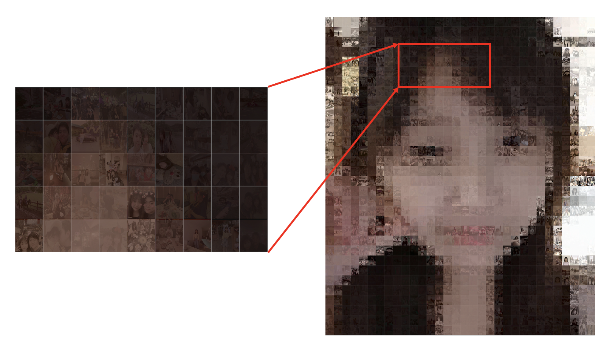

## Photo2Face

Photo2face stitches thousands of photos into a single target photo.




## Installation

```
pip install -f requirements.txt
```


## Configuration

- anchor_img_path: the path of image that needs to be reconstructed
- (num_row, num_column) is the number of rows and columns the anchor image is cut into
- output_path: The save path of the output image
- img_lib: a collection of images that can be used to reconstruct the anchor

## Run

```
python face2photo.py
```

